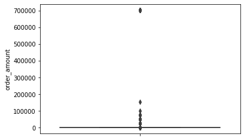
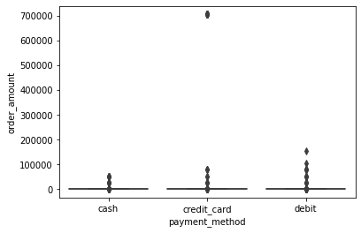

```python
import numpy as np
import pandas as pd
import seaborn as sns
import matplotlib.pyplot as plt
import warnings
from IPython.display import display, Markdown, Latex
```

# Fall 2021 Data Science Intern Challenge
ChengDa Zheng

*Run Online:* https://colab.research.google.com/drive/1TlF3dlUMi8qCWf79Y1upCzYIiCkorRuu?usp=sharing

# Question 1


```python
from google.colab import drive
drive.mount('/content/drive')
```

    Mounted at /content/drive


On Shopify, we have exactly 100 sneaker shops, and each of these shops sells only one model of shoe. We want to do some analysis of the average order value (AOV). When we look at orders data over a 30 day window, we naively calculate an AOV of $3145.13. Given that we know these shops are selling sneakers, a relatively affordable item, something seems wrong with our analysis. 

Think about what could be going wrong with our calculation. Think about a better way to evaluate this data. 
What metric would you report for this dataset?
What is its value?


### Answer:

First of all, let's look at the dataframe.


```python
df = pd.read_csv("/content/drive/MyDrive/Colab Notebooks/2019 Winter Data Science Intern Challenge Data Set.csv")
df
```


<div>


<table border="1" class="dataframe">
  <thead>
    <tr style="text-align: right;">
      <th></th>
      <th>order_id</th>
      <th>shop_id</th>
      <th>user_id</th>
      <th>order_amount</th>
      <th>total_items</th>
      <th>payment_method</th>
      <th>created_at</th>
    </tr>
  </thead>
  <tbody>
    <tr>
      <th>0</th>
      <td>1</td>
      <td>53</td>
      <td>746</td>
      <td>224</td>
      <td>2</td>
      <td>cash</td>
      <td>2017-03-13 12:36:56</td>
    </tr>
    <tr>
      <th>1</th>
      <td>2</td>
      <td>92</td>
      <td>925</td>
      <td>90</td>
      <td>1</td>
      <td>cash</td>
      <td>2017-03-03 17:38:52</td>
    </tr>
    <tr>
      <th>2</th>
      <td>3</td>
      <td>44</td>
      <td>861</td>
      <td>144</td>
      <td>1</td>
      <td>cash</td>
      <td>2017-03-14 4:23:56</td>
    </tr>
    <tr>
      <th>3</th>
      <td>4</td>
      <td>18</td>
      <td>935</td>
      <td>156</td>
      <td>1</td>
      <td>credit_card</td>
      <td>2017-03-26 12:43:37</td>
    </tr>
    <tr>
      <th>4</th>
      <td>5</td>
      <td>18</td>
      <td>883</td>
      <td>156</td>
      <td>1</td>
      <td>credit_card</td>
      <td>2017-03-01 4:35:11</td>
    </tr>
    <tr>
      <th>...</th>
      <td>...</td>
      <td>...</td>
      <td>...</td>
      <td>...</td>
      <td>...</td>
      <td>...</td>
      <td>...</td>
    </tr>
    <tr>
      <th>4995</th>
      <td>4996</td>
      <td>73</td>
      <td>993</td>
      <td>330</td>
      <td>2</td>
      <td>debit</td>
      <td>2017-03-30 13:47:17</td>
    </tr>
    <tr>
      <th>4996</th>
      <td>4997</td>
      <td>48</td>
      <td>789</td>
      <td>234</td>
      <td>2</td>
      <td>cash</td>
      <td>2017-03-16 20:36:16</td>
    </tr>
    <tr>
      <th>4997</th>
      <td>4998</td>
      <td>56</td>
      <td>867</td>
      <td>351</td>
      <td>3</td>
      <td>cash</td>
      <td>2017-03-19 5:42:42</td>
    </tr>
    <tr>
      <th>4998</th>
      <td>4999</td>
      <td>60</td>
      <td>825</td>
      <td>354</td>
      <td>2</td>
      <td>credit_card</td>
      <td>2017-03-16 14:51:18</td>
    </tr>
    <tr>
      <th>4999</th>
      <td>5000</td>
      <td>44</td>
      <td>734</td>
      <td>288</td>
      <td>2</td>
      <td>debit</td>
      <td>2017-03-18 15:48:18</td>
    </tr>
  </tbody>
</table>
<p>5000 rows × 7 columns</p>
</div>


It seems like the outliers make the calculation not accurate. Let's use box plot to verify the guess. 


```python
sns.boxplot(x="variable", y="value",data=pd.melt(df[["total_items","order_amount"]]))
```


    <matplotlib.axes._subplots.AxesSubplot at 0x7f9b9c49e690>





```python
sns.boxplot(y="order_amount", data=df,  orient='v')
```


    <matplotlib.axes._subplots.AxesSubplot at 0x7f9b9c2dbd10>


Now it is very clear that there are a lot of outliers that will affect the calculation of AOV. But I mentioned that there are different payment methods. Seems like it is impossible to pay such a large amount of money in cash? Let verify the outliers by the payment methods.


```python
sns.boxplot(y="total_items", x= "payment_method", data=df,  orient='v')
```


    <matplotlib.axes._subplots.AxesSubplot at 0x7f9b9be110d0>





```python
sns.boxplot(y="order_amount", x= "payment_method", data=df,  orient='v')
```


    <matplotlib.axes._subplots.AxesSubplot at 0x7f9b9bd3e150>


Now, from the graphs above. We found that the outliers exist in all three categories. However, some "super" outliers only exist in the credit card category. Also, the large order amount seems related to the large number of total order items.


Base on the findings above. I draft the solutions as below. The function has two methods. One is the direct method which will remove all the outliers which are out of 3 IQR and calculate the AOV. The second method is a weighted average method, which will calculate the AOV for each of the payment method groups and multiply by their weight out of the total, then sum them up. 


```python
def calculate(df: pd.DataFrame, method: int, *describe: bool)->str:
  '''
    Given a panda dataframe with a pre-defined structure, which should include the column 'total_items' and 'order_amount'.
      Method 1 will remove all outliers which lie outside of +-1.5 IQR and then use sum of order amount devided sum of total items.
      Method 2 will calculate the order amount divided by total items in each payment method groups and take the weighted average.
    Describe is False by default, when it is True, the function will return the the describe of outlier in tuple format for both 'total_items' and 'order_amount' columns.
    Complexity: O(1)
    >>> calculate(df, 1)
    'Adjusted AOV is $362.87'
    >>> calculate(df, 2)
    'Adjusted AOV is $398.13'
    >>> calculate(df, 2, True)    
    ('Number of data out of range: 987, Percentage it takes for overall dataset: 2.82%',
     'Number of data out of range: 189, Percentage it takes for overall dataset: 0.54%')
  '''
  #Check if columns 'total_items', 'order_amount', and 'payment_method' exisit in the dataframe.
  if (not all(x in list(df.columns) for x in ['total_items', 'order_amount', 'payment_method'])):
    raise ValueError("Dataframe structure is wrong") 
  #A function to calculate the Q1, Q3, IQR and outliers.
  def trackIQR(df,col_name, describe=False):
    Q1 = df[col_name].quantile(0.25)
    Q3 = df[col_name].quantile(0.75)
    IQR = Q3 - Q1
    out_rage_size = df[(Q1 - 1.5*IQR >= df[col_name]) |  (df[col_name] >= Q3 + 1.5*IQR)].size
    # return the dataset outlier description message if describe is TRUE.
    if (not describe):
      return (out_rage_size/df.size)
    return ("Number of data out of range:{0:4d}, Percentage it takes for overall dataset: {1:.2%}".format(out_rage_size, out_rage_size/df.size))
  # Method 2 will calculate the order amount divided by total items in each payment method groups and sum up the values.
  def method2(df, med_val=0):
    # prec is a dict to store each payment_method group as well as their weighted percentage.
    prec = dict(df.payment_method.value_counts()/df.shape[0])
    for i in df.payment_method.unique():
      med_val+=(df[df["payment_method"]==i]["order_amount"].sum()/df[df["payment_method"]==i]["total_items"].sum())*prec[i]
    return 'Adjusted AOV is ${:,.2f}'.format(med_val)
  if (describe):
    return trackIQR(df,"order_amount",True), trackIQR(df,"total_items",True)
  #Method 1 will remove all outliers which lie outside of +-1.5 IQR and then use sum of order amount devided sum of total items.
  elif (method == 1):
    # Only adopt method 1 when there are not much outbonded data, the threshold is 5%.
    if (trackIQR(df,"order_amount")<0.05 and trackIQR(df,"total_items")<0.05):
      newdf = df[(np.abs(df.order_amount-df.order_amount.mean()) <= (3*df.order_amount.std())) & (np.abs(df.total_items-df.total_items.mean()) <= (3*df.total_items.std()))].reset_index()
      return 'Adjusted AOV is ${:,.2f}'.format(newdf['order_amount'].sum()/newdf['total_items'].sum())
    # Auto switch method 2 with a kindly warning.
    warnings.warn("Too much outbonded data, will use method 2")
    return method2(df)
  elif (method==2):
    return method2(df)
  else:
    # raise error if arguement is mistyped. 
    raise ValueError("method must be either 1 or 2") 

```


```python
display(Markdown('The **first method** gives the result as below:'), calculate(df, 1))
display(Markdown('<br /> The **second method** gives the result as below:'), calculate(df, 2))
```


The **first method** gives the result as below:


    'Adjusted AOV is $362.87'


<br /> The **second method** gives the result as below:


    'Adjusted AOV is $397.86'


# Question 2
For this question you’ll need to use SQL. Follow this link to access the data set required for the challenge. Please use queries to answer the following questions. Paste your queries along with your final numerical answers below.

* How many orders were shipped by Speedy Express in total?
* What is the last name of the employee with the most orders?
* What product was ordered the most by customers in Germany?


### Answers:
*How many orders were shipped by Speedy Express in total?*

```
SELECT count(*) as total_order FROM Orders o, Shippers s where o.ShipperID = s.ShipperID and s.ShipperName = 'Speedy Express'
```

**Answer:54**


*What is the last name of the employee with the most orders?*

```
SELECT 
  LastName 
FROM 
(SELECT count(orderID) as counts, * FROM Orders group by EmployeeID ORDER BY counts DESC LIMIT 1) o, 
Employees e 
WHERE o.EmployeeID = e.EmployeeID
```
OR
```
SELECT 
  Employees.LastName
FROM Employees 
INNER JOIN orders ON Employees.EmployeeID = orders.EmployeeID 
GROUP BY Employees.EmployeeID, 
         Employees.LastName
ORDER BY COUNT(orders.orderid) DESC
LIMIT 1
```

**Answer: Peacock**


*What product was ordered the most by customers in Germany?*


```
SELECT ProductName 
From orderdetails od 
left join orders o on o.OrderID = od.OrderID 
left join customers c on c.CustomerID = o.CustomerID 
join Products p on od.ProductID = p.ProductID 
where c.Country = 'Germany' 
group by od.productid 
order by sum(quantity) 
DESC LIMIT 1
```

**Answer: Boston Crab Meat**
